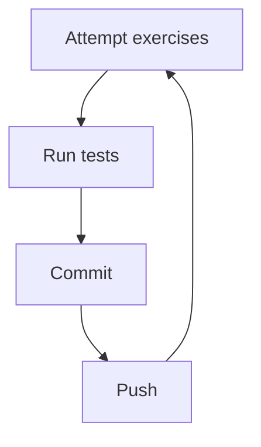

<p align="center">
  
</p>

# Hackulator

Welcome to the most hilariously broken calculator on the internet.

Bugs... bugs everywhere!

## Getting started

1. Make sure your machine is set up according to the instructions with

   - [bash](https://tech-docs.corndel.com/bash/)
   - [vscode](https://tech-docs.corndel.com/vscode/)
   - [git](https://tech-docs.corndel.com/git/)
   - [java and maven](https://tech-docs.corndel.com/java/installation.html)

1. Clone the repository (i.e. download it), so you have a copy on your machine:

   ```bash
   git clone <your-repository-url>
   ```

1. Once cloned, open a terminal in the project folder, and run

   ```bash
   ./mvnw build
   ```

   You should see some output in the terminal saying the packages have been
   audited. If you've got this far, great! You're on track.

> [!NOTE]
>
> If you see a message about "vulnerabilities", don't worry. We aren't deploying
> our code. This is something we'll talk about later.

## Testing

To check if your solution for one of the exercises has worked, you can run the command

```bash
./mvnw test
```

in the terminal.

> [!TIP]
>
> You can choose which test to run usin the `-Dtest=` parameter.
> E.g. Runnning
>
> ```bash
> ./mvnw test -Dtest=AddTest
> ```
>
> in the terminal will test only the `Add.java` code using the `AddTest.java` test file.

## Committing

Each time you fix a bug, you should commit your code with a useful message.

For example,

```bash
git commit -am "fixes Add.java"
```

or

```bash
git commit -am "attempts Subtract.java (feedback needed)"
```

## Pushing

After committing, you can push your changes to Github by running

```bash
git push
```

in the terminal.

This means other people can see the code you've written, and you can get help if needed.

## Workflow

In summary, your workflow should look like this:



## Deep dive

Before attempting the deep dive, check out the Foundations section
of the Tech Docs, starting with [Variables](https://tech-docs.corndel.com/java/variables.html).

We'd recommend squashing the bugs in the following order:

1. [Add.java](/src/main/java/com/corndel/hackulator/Add.java)

1. [Subtract.java](/src/main/java/com/corndel/hackulator/Subtract.java)

1. [Multiply.java](/src/main/java/com/corndel/hackulator/Multiply.java)

1. [Divide.java](/src/main/java/com/corndel/hackulator/Divide.java)

1. [Average.java](/src/main/java/com/corndel/hackulator/Average.java)

1. [Power.java](/src/main/java/com/corndel/hackulator/Power.java)

1. [Remainder.java](/src/main/java/com/corndel/hackulator/Remainder.java)

1. [MaxOfThree.java](/src/main/java/com/corndel/hackulator/MaxOfThree.java)

1. [Heron.java](/src/main/java/com/corndel/hackulator/Heron.java)

1. [Gcd.java](/src/main/java/com/corndel/hackulator/Gcd.java)

## Extension

Are there any other functions you could add to the calculator?
